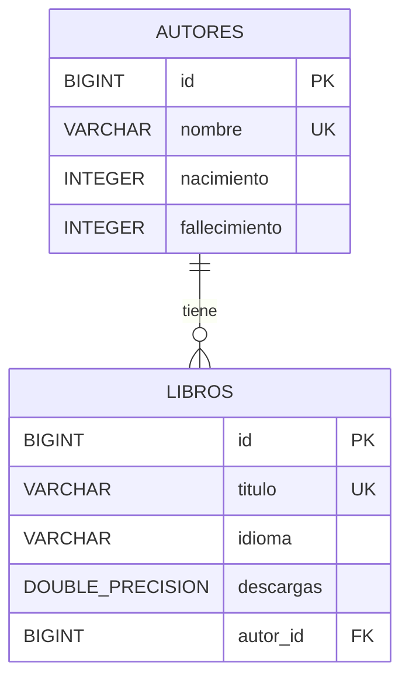

# 📚 LiterAlura Core

[](https://www.oracle.com/java/)
[](https://spring.io/projects/spring-boot)
[](https://www.postgresql.org/)
[](https://www.docker.com/)
[](https://literalura-front.netlify.app/)

> **LiterAlura Core** es una API REST desarrollada con **Spring Boot 3** y **Java 21** bajo una **Arquitectura Hexagonal (Puertos y Adaptadores)**. Su propósito es buscar libros en la API pública de [Gutendex](https://gutendex.com/) (Proyecto Gutenberg), registrarlos en una base de datos relacional **PostgreSQL** evitando duplicados, y permitir la consulta y filtrado de obras y autores a través de endpoints REST.

🌐 **Demo del Frontend en Producción:** [https://literalura-front.netlify.app/](https://literalura-front.netlify.app/)

---

## 📑 Tabla de Contenidos

1. [Características Principales](#-características-principales)
2. [Arquitectura del Proyecto](#-arquitectura-del-proyecto)
3. [Stack Tecnológico](#-stack-tecnológico)
4. [Estructura del Proyecto](#-estructura-del-proyecto)
5. [Variables de Entorno](#-variables-de-entorno)
6. [Instalación y Ejecución](#-instalación-y-ejecución)
   - [Requisitos Previos](#requisitos-previos)
   - [Paso a Paso con Maven](#paso-a-paso-con-maven)
   - [Ejecución con Docker](#ejecución-con-docker)
7. [Documentación de la API (Endpoints)](#-documentación-de-la-api-endpoints)
8. [Modelo de Base de Datos](#-modelo-de-base-de-datos)
9. [Despliegue y CI/CD](#-despliegue-y-cicd)

---

## ✨ Características Principales

- 🔍 **Búsqueda Externa en Gutendex:** Consume la API de Gutendex mediante cliente HTTP nativo (`java.net.http.HttpClient`) para consultar libros por título.
- 💾 **Persistencia Inteligente en PostgreSQL:** Al buscar un libro, si existe en la API externa y aún no está registrado localmente, se guarda automáticamente vinculándolo con su autor.
- 🚫 **Control de Duplicados:** Valida la existencia previa de libros y autores para evitar registros duplicados.
- 🌐 **Filtrado por Idioma:** Permite consultar todos los libros almacenados según su código de idioma (`es`, `en`, `fr`, `pt`, etc.).
- ⏳ **Consulta Histórica de Autores:** Permite listar autores registrados que estaban vivos en un año determinado mediante consultas JPQL optimizadas.
- 🌍 **Soporte CORS:** Totalmente configurado para integrarse con clientes web (como el frontend desplegado en Netlify).

---

## 🏛️ Arquitectura del Proyecto

El proyecto implementa los principios de **Arquitectura Hexagonal (Ports & Adapters)** y **Clean Architecture**, asegurando desacoplamiento entre el núcleo del dominio y los componentes de infraestructura (base de datos, controladores web y APIs externas):

```
com.literalura_core/
├── domain/                          # CAPA DE DOMINIO (Reglas de negocio puras)
│   ├── model/                       # Modelos de dominio inmutables (Records)
│   │   ├── Libro.java
│   │   └── Autor.java
│   └── ports/                       # Interfaces de interacción (Contratos)
│       ├── in/                      # Casos de uso de entrada
│       │   └── BuscarLibroUseCase.java
│       └── out/                     # Puertos de salida hacia infraestructura
│           ├── LibreriaExternaPort.java
│           └── LibroRepositoryPort.java
│
├── application/                     # CAPA DE APLICACIÓN (Casos de uso / Orquestación)
│   └── service/
│       └── LibroService.java
│
└── infrastructure/                  # CAPA DE INFRAESTRUCTURA (Adaptadores)
    └── adapter/
        ├── in/                      # Adaptadores de Entrada
        │   └── web/
        │       └── LibroController.java   # Controlador REST (/libros)
        └── out/                     # Adaptadores de Salida
            ├── gutendex/            # Adaptador externo Gutendex API
            │   ├── GutendexAdapter.java
            │   └── dto/             # DTOs de deserialización JSON (Jackson)
            └── persistence/         # Adaptador de persistencia JPA PostgreSQL
                ├── LibroPersistenceAdapter.java
                ├── entity/          # Entidades JPA (Hibernate)
                │   ├── LibroEntity.java
                │   └── AutorEntity.java
                └── repository/      # Interfaces Spring Data JPA
                    ├── LibroRepository.java
                    └── AutorRepository.java
```

---

## 🛠️ Stack Tecnológico

| Tecnología | Descripción |
| :--- | :--- |
| **Java 21** | Versión LTS moderna de Java con Virtual Threads y Records. |
| **Spring Boot 3.2.3** | Framework principal para la construcción de microservicios y APIs REST. |
| **Spring Data JPA** | Abstracción para el acceso a datos y operaciones CRUD / JPQL. |
| **PostgreSQL** | Motor de base de datos relacional para almacenamiento en producción y local. |
| **Hibernate ORM** | Mapeo objeto-relacional y gestión automática del esquema. |
| **Jackson** | Procesamiento y mapeo de datos JSON (`@JsonAlias`, `@JsonProperty`). |
| **Project Lombok** | Reducción de código boilerplate en entidades JPA. |
| **Java HTTP Client** | Cliente HTTP moderno nativo para consumo asíncrono de APIs externas. |
| **Docker** | Empaquetado en contenedor ligero con imagen multi-stage Eclipse Temurin 21. |
| **GitLab CI** | Pipeline de integración continua para validación y empaquetado del artefacto JAR. |

---

## ⚙️ Variables de Entorno

La aplicación utiliza variables de entorno para su parametrización. Puedes basarte en el archivo [.env.example](file:///.env.example) para configurar tu archivo `.env` o definir las variables en tu proveedor cloud (Render, Railway, Fly.io, etc.):

| Variable | Descripción | Valor por Defecto |
| :--- | :--- | :--- |
| `PORT` | Puerto en el que se ejecuta el servidor Spring Boot | `8080` |
| `SPRING_DATASOURCE_URL` | URL de conexión JDBC a PostgreSQL | `jdbc:postgresql://localhost:5432/literalura` |
| `SPRING_DATASOURCE_USERNAME` | Usuario de la base de datos PostgreSQL | `literalura_user` |
| `SPRING_DATASOURCE_PASSWORD` | Contraseña del usuario de PostgreSQL | `literalura_pass` |
| `SPRING_JPA_HIBERNATE_DDL_AUTO` | Modo de actualización de esquema DDL (`update`, `validate`, `none`) | `update` |
| `SPRING_JPA_SHOW_SQL` | Muestra las sentencias SQL en consola (`true`, `false`) | `true` |

---

## 🚀 Instalación y Ejecución

### Requisitos Previos

- **JDK 21** instalado ([Eclipse Temurin](https://adoptium.net/) recomendado).
- **PostgreSQL 15+** activo y accesible.
- **Git** y **Maven** (o usar el wrapper incluido `./mvnw`).
- *(Opcional)* **Docker** instalado.

---

### Paso a Paso con Maven

1. **Clonar el repositorio:**
   ```bash
   git clone https://github.com/tu-usuario/literatura-core.git
   cd literatura-core
   ```

2. **Configurar las variables de entorno:**
   Copia el archivo de ejemplo y edita tus credenciales:
   ```bash
   cp .env.example .env
   ```

3. **Crear la base de datos en PostgreSQL:**
   ```sql
   CREATE DATABASE literalura;
   ```

4. **Compilar y empaquetar el proyecto:**
   ```bash
   ./mvnw clean package -DskipTests
   ```

5. **Ejecutar la aplicación:**
   ```bash
   ./mvnw spring-boot:run
   ```
   *La API estará disponible en `http://localhost:8080`.*

---

### Ejecución con Docker

El proyecto incluye un `Dockerfile` optimizado con *multi-stage build*:

1. **Construir la imagen Docker:**
   ```bash
   docker build -t literalura-core:latest .
   ```

2. **Ejecutar el contenedor pasando las variables de entorno:**
   ```bash
   docker run -d -p 8080:8080 \
     -e SPRING_DATASOURCE_URL=jdbc:postgresql://host.docker.internal:5432/literalura \
     -e SPRING_DATASOURCE_USERNAME=literalura_user \
     -e SPRING_DATASOURCE_PASSWORD=tu_password \
     -e SPRING_JPA_HIBERNATE_DDL_AUTO=update \
     --name literalura-app \
     literalura-core:latest
   ```

---

## 📖 Documentación de la API (Endpoints)

Base URL local: `http://localhost:8080`

### Resumen de Rutas

| Método | Endpoint | Descripción |
| :---: | :--- | :--- |
| `GET` | `/libros/{titulo}` | Busca un libro por título en Gutendex, lo guarda en la base de datos si no existe y lo retorna. |
| `GET` | `/libros` | Retorna todos los libros registrados en la base de datos. |
| `GET` | `/libros/idioma/{idioma}` | Filtra los libros registrados por código de idioma (ej: `es`, `en`, `fr`). |
| `GET` | `/libros/autores` | Retorna la lista de todos los autores registrados en la base de datos. |
| `GET` | `/libros/autores-vivos/{anio}` | Retorna los autores que estaban vivos en un año específico. |

---

### Detalle de Endpoints

#### 1. Buscar y registrar libro por título
*Busca en la API de Gutendex. Si lo encuentra, lo almacena en PostgreSQL y retorna los datos.*

- **Método:** `GET`
- **Ruta:** `/libros/{titulo}`
- **Ejemplo de Petición:** `GET /libros/don%20quijote`
- **Respuesta Exitosa (`200 OK`):**
  ```json
  {
    "title": "Don Quijote",
    "authors": "Cervantes Saavedra, Miguel de",
    "birth_year": 1547,
    "death_year": 1616,
    "languages": "es",
    "download_count": 5283.0
  }
  ```
- **Respuesta No Encontrado (`404 Not Found`):** Si el libro no existe en Gutendex.

---

#### 2. Listar todos los libros registrados
*Obtiene todos los libros guardados previamente en la base de datos local.*

- **Método:** `GET`
- **Ruta:** `/libros`
- **Respuesta Exitosa (`200 OK`):**
  ```json
  [
    {
      "title": "Don Quijote",
      "authors": "Cervantes Saavedra, Miguel de",
      "birth_year": 1547,
      "death_year": 1616,
      "languages": "es",
      "download_count": 5283.0
    },
    {
      "title": "Pride and Prejudice",
      "authors": "Austen, Jane",
      "birth_year": 1775,
      "death_year": 1817,
      "languages": "en",
      "download_count": 68420.0
    }
  ]
  ```

---

#### 3. Listar libros por idioma
*Filtra los libros almacenados según su código de idioma.*

- **Método:** `GET`
- **Ruta:** `/libros/idioma/{idioma}`
- **Ejemplo de Petición:** `GET /libros/idioma/es`
- **Parámetros de Ruta:**
  - `idioma` (string): Código de 2 caracteres (`es` = Español, `en` = Inglés, `fr` = Francés, `pt` = Portugués).
- **Respuesta Exitosa (`200 OK`):**
  ```json
  [
    {
      "title": "Don Quijote",
      "authors": "Cervantes Saavedra, Miguel de",
      "birth_year": 1547,
      "death_year": 1616,
      "languages": "es",
      "download_count": 5283.0
    }
  ]
  ```

---

#### 4. Listar todos los autores
*Obtiene todos los autores registrados en la base de datos junto a sus años de vida.*

- **Método:** `GET`
- **Ruta:** `/libros/autores`
- **Respuesta Exitosa (`200 OK`):**
  ```json
  [
    {
      "nombre": "Cervantes Saavedra, Miguel de",
      "nacimiento": 1547,
      "fallecimiento": 1616
    },
    {
      "nombre": "Austen, Jane",
      "nacimiento": 1775,
      "fallecimiento": 1817
    }
  ]
  ```

---

#### 5. Listar autores vivos en un determinado año
*Obtiene los autores que nacieron antes o durante el año consultado y cuyo fallecimiento fue posterior o es desconocido.*

- **Método:** `GET`
- **Ruta:** `/libros/autores-vivos/{anio}`
- **Ejemplo de Petición:** `GET /libros/autores-vivos/1600`
- **Respuesta Exitosa (`200 OK`):**
  ```json
  [
    {
      "nombre": "Cervantes Saavedra, Miguel de",
      "nacimiento": 1547,
      "fallecimiento": 1616
    }
  ]
  ```

---

## 🗄️ Modelo de Base de Datos

El esquema relacional está compuesto por dos tablas vinculadas mediante clave foránea:



- **`autores`:** Almacena el nombre único del autor, su año de nacimiento y su año de fallecimiento.
- **`libros`:** Almacena el título del libro (único), el idioma principal, el conteo de descargas y la referencia (`autor_id`) al autor correspondiente.

---

## ☁️ Despliegue y CI/CD

- **Integración Continua:** Configurada a través de `.gitlab-ci.yml`, asegurando que cada commit pase por el proceso de compilación y empaquetado del artefacto `.jar`.
- **Contenedor:** El `Dockerfile` utiliza `eclipse-temurin:21-jdk-alpine` para generar imágenes ligeras y seguras con flags de memoria JVM optimizados (`-Xmx350m -Xms350m`).
- **Frontend:** Conectado con la aplicación web desplegada en [Netlify](https://literalura-front.netlify.app/).

---

## 📄 Licencia

Este proyecto fue desarrollado como parte del desafío LiterAlura. Distribuido bajo fines educativos y de demostración técnica.
